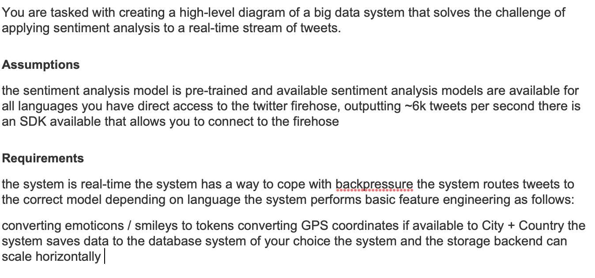
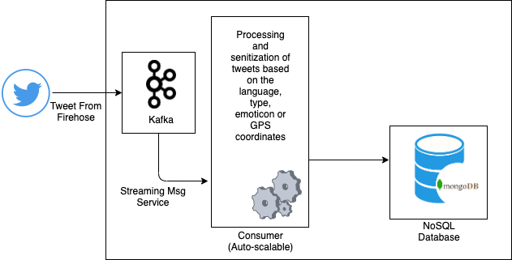

# RELAYR_PYTHON #

Demonstration of Requirements understanding, proposing a solution and implementation. 

---
## Solution to Python Problem ##
#### [Relayr Python Test](https://github.com/naeemark/relayr_python/) ####
---

### Problem Statement:

---
### Proposed Solution ###
- At a high level we can use a distributed queue such as kafka to cope with back pressure of the high velocity stream of tweets. 

- Auto-scalable consumers will receive messages from kafka, sanitize them and then store in a NoSQL database like mongodb as it can easily scale horizontally through replication and sharding

- Alternatively, hadoop cluster can also be used to transform data (emoticon and GPS replacement) but its more suited to batch processing not realtime stream input.

- If we need to process multiple tweets simultaneously using map-reduce approach, Hadoop would be a better fit. But, according to the given scenario where we are required to deal with tweets one-by-one a real time queue (maybe of Pub/Sub type) is more suitable

#### Proposed flow ####
