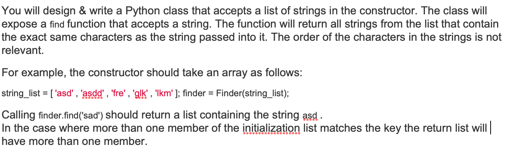

# RELAYR_PYTHON #

Demonstration of Requirements understanding, proposing a solution and implementation. 

---
## Solution to Deep-Dive Scenario ##
#### [Relayr Onboarding Big Data Deep-Dive](DEEPDIVE.md) ####
---

### What is this repository for? ###

* This app is built as assignment for relayr. 
* Adds `pytest` for unit testing.
* Version 1.0.0

### Problem Statement:

## How do I get set up? ##

### How to set up ###
To set-up the project locally you need to clone this repo, from `master` or `develop` branch or some latest `TAG`

### Configuration ###

Please sync and resolve dependencies by using
- `pipenv install`

### Test App
- Run `pipenv shell`   
- Run `pytest`   
   OR
- Run `pytest -v` with vorbose   
   OR
- Run `pytest -s -v --durations=0  --count=2` for duration and multiple executions      
   OR
- Run `pytest --cov-report term-missing --cov=src tests/ --cov-report=html -v && open htmlcov/index.html` to open unit test coverage report

### Pre-reqs

- [python 3.7](https://www.python.org/downloads/release/python-376/)
- [pipenv](https://pipenv-fork.readthedocs.io/en/latest/)
- [pytest](https://docs.pytest.org/en/latest/)
- [pytest-cov](https://pypi.org/project/pytest-cov/)

## Requirements ##

- See [`Pipfile`](/Pipfile)

## Major Libraries and tools included: ##

- pytest
- pytest-cov
- pipenv

## Distribution ##
- A git repository

## Contribution guidelines ##

- Forks are always appreciated
